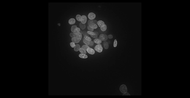
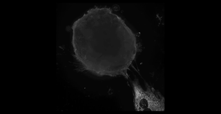
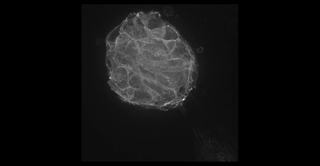
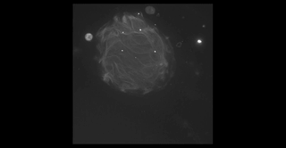
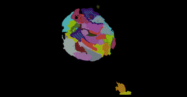
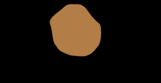

# Hi, I'm Greg Way 

> **Mission:** Reduce human suffering through biomedical data science.

I'm an Assistant Professor in the [Department of Biomedical Informatics](https://medschool.cuanschutz.edu/dbmi) and a member of the [Center for Health AI](https://medschool.cuanschutz.edu/ai) at the [University of Colorado Anschutz Medical Campus](https://medschool.cuanschutz.edu/), where I lead the [Way Science Lab](https://www.waysciencelab.com).

---

## Underlying hypothesis

> Cell morphology encodes disease state. By comparing morphological profiles of healthy (wild-type) cells against diseased cells — for example, identifying the phenotypic signature that distinguishes NF1-null Schwann cells from wild-type — we define **phenotypic targets** to screen against. This approach is complementary to gene-target-based drug discovery, and may better capture where disease actually manifests at the cellular level. We then screen large compound libraries against these phenotypic signatures to find drugs that restore healthy morphology.

---

## Highlights

| | |
|---|---|
| 🎓 **Ph.D.** | [Genomics & Computational Biology](https://www.med.upenn.edu/gcb/), [University of Pennsylvania](https://www.upenn.edu/) |
| 🔬 **Postdoc** | [Imaging Platform](https://www.broadinstitute.org/imaging), [Broad Institute of MIT and Harvard](https://www.broadinstitute.org/) |
| 🏫 **Faculty** | Assistant Professor, [University of Colorado Anschutz](https://medschool.cuanschutz.edu/dbmi) (2021–present) |
| 👩‍🔬 **Lab** | Seven scientists spanning data science, AI, machine learning, cell biology, and biomedical informatics |
| 🎓 **Training** | Mentoring Ph.D. students, postdocs, and undergraduate researchers across disciplines in open science practices |
| 📚 **Teaching** | Developed [CPBS7601](https://github.com/WayScience/CPBS7601) — *Maximizing Reproducibility in Computational Biology* at CU Anschutz |
| 🌱 **Co-founder** | [Software Gardening](https://software-gardening.github.io) — sustainable software practices for scientific computing |
| 🔭 **Org lead** | [Cytomining](https://cytomining.github.io/) — open-source ecosystem for image-based profiling |

---

## Research

My lab develops computational methods and open-source software to analyze high-content microscopy images of cells, partnering with collaborators worldwide to extract biological meaning and advance drug discovery. Our disease focus spans:

- 🧬 **NF1 personalized medicine** — identifying morphological signatures of [Neurofibromatosis Type 1](https://github.com/WayScience/NF1_3D_organoid_profiling_pipeline) and running high-throughput drug screens to find compounds that restore a healthy phenotype; see [publications](https://scholar.google.com/citations?user=iDKZaA4AAAAJ&hl=en)
- ❤️ **Cardiac fibrosis** — high-throughput drug screening using morphological profiles of cardiac fibroblasts to prioritize therapeutic candidates
- 🎗️ **Pediatric cancer** — high-throughput phenotypic drug screening across cancer models with few existing treatment options
- 🔬 **Image-based profiling** — extracting rich, reproducible biological signals from microscopy images at scale
- 🤖 **Machine learning for biology** — models that connect cell morphology to genetic, molecular, and disease states
- 🛠️ **Open-source software** — reproducible tools that make high-content imaging data accessible to the broader research community

### NF1 patient-derived organoids — high-content imaging for drug discovery

[Neurofibromatosis Type 1 (NF1)](https://www.nih.gov/news-events/nih-research-matters/understanding-neurofibromatosis-type-1) is a rare genetic disease with significant unmet therapeutic need.
We use patient-derived organoid models combined with high-content microscopy and machine learning to identify morphological disease signatures and perform high-throughput drug screening — with the goal of enabling **personalized medicine** for NF1 patients.

The z-stack below shows raw fluorescence channels alongside automated segmentation masks for a single NF1 organoid:

<table>
  <thead>
    <tr>
      <th align="center">DNA (405nm)</th>
      <th align="center">ER (488nm)</th>
      <th align="center">AGP (555nm)</th>
      <th align="center">Mitochondria (640nm)</th>
    </tr>
  </thead>
  <tbody>
    <tr>
      <td align="center"></td>
      <td align="center"></td>
      <td align="center"></td>
      <td align="center"></td>
    </tr>
    <tr>
      <th align="center">Nuclei mask</th>
      <th align="center">Cell mask</th>
      <th align="center">Cytoplasm mask</th>
      <th align="center">Organoid mask</th>
    </tr>
    <tr>
      <td align="center"></td>
      <td align="center"></td>
      <td align="center"></td>
      <td align="center"></td>
    </tr>
  </tbody>
</table>

→ See the [NF1 organoid profiling pipeline](https://github.com/WayScience/NF1_3D_organoid_profiling_pipeline) for full analysis code and data

**Extracting features from these organoids with:**

[ZEDProfiler](https://github.com/WayScience/zedprofiler) is a CPU-first toolkit for 3D image feature extraction built specifically for high-content organoid profiling.
It handles multi-channel volumetric data (DNA, ER, AGP, mitochondria), anisotropic voxel spacing, and multiple segmentation compartments (nuclei, cytoplasm, whole cell, organoid) — computing the morphological measurements that feed directly into our drug screening pipeline.

---

## Key Projects

<table>
  <thead>
    <tr>
      <th colspan="2">Project</th>
      <th>Description</th>
    </tr>
  </thead>
  <tbody>
    <tr>
      <td style="border-right: 0;"></td>
      <td style="border-left: 0;"><a href="https://pycytominer.readthedocs.io/">pycytominer</a></td>
      <td>Python package for image-based profiling bioinformatics</td>
    </tr>
    <tr>
      <td style="border-right: 0;"></td>
      <td style="border-left: 0;"><a href="https://cytomining.github.io/CytoTable/">CytoTable</a></td>
      <td>Harmonize high-content image analysis tool outputs</td>
    </tr>
    <tr>
      <td style="border-right: 0;"></td>
      <td style="border-left: 0;"><a href="https://cytomining.github.io/coSMicQC/">coSMicQC</a></td>
      <td>Single-cell morphology quality control</td>
    </tr>
    <tr>
      <td style="border-right: 0;"></td>
      <td style="border-left: 0;"><a href="https://github.com/WayScience/buscar">buscar</a></td>
      <td>Perturbation hit calling for high-content screening</td>
    </tr>
  </tbody>
</table>

→ See the full [Cytomining ecosystem](https://cytomining.github.io/) for more tools and projects.

---

## Software Gardening

I co-founded [**Software Gardening**](https://software-gardening.github.io/almanack) — an ecosystem of applied guidance and tools for **sustainable software development and maintenance** in scientific computing.
Software Gardening is supported by the Better Scientific Software program, the Sustainable Horizons Institute, the U.S. Department of Energy, and the National Science Foundation.

→ [Explore the Software Gardening Almanack](https://software-gardening.github.io/almanack)
→ [Read the BSSw blog post](https://bssw.io/blog_posts/growing-resilient-scientific-software-ecosystems-introducing-the-software-gardening-almanack)

---

## Cytomining

I contribute to and help maintain the [Cytomining](https://github.com/cytomining) open-source ecosystem and am a member of the [CytoData](https://www.cytodata.org/) scientific community.

- 💬 Join us on [Discord](https://discord.gg/dgEDz6xzfJ)
- 🏫 Learn more at [cytodata.org](https://www.cytodata.org/)
- 🌈 We follow a [Code of Conduct](https://github.com/cytomining/.github/blob/main/CODE_OF_CONDUCT.md)

---

## Publications

50+ peer-reviewed publications with **>10,000 citations** and an h-index of 25+, including work in *Nature*, *Nature Methods*, *Nature Communications*, *Cell*, *Science*, *Circulation*, *PNAS*, *eLife*, and *Cell Systems*. Research spans image-based profiling, machine learning for biology, cancer genomics, and open-source software.

→ [Full publication list on Google Scholar](https://scholar.google.com/citations?user=iDKZaA4AAAAJ&hl=en)

---

## Community Engagement

### Advisory Boards

| Organization | Role | Years |
|---|---|---|
| [Infixion Biosciences](https://infixionbio.com/) | Scientific Advisory Board | 2019 – Present |
| [CytoData Society](https://www.cytodata.org/) | Operations Officer | 2020 – 2023 |
| [Society of Biomolecular Imaging and Informatics](https://www.sbi2.org/) | Board of Directors | 2021 – 2023 |
| [Neuroendocrine Tumor Research Foundation](https://netrf.org/) | Board of Scientific Advisors | 2024 – Present |
| [Bio-protocol](https://bio-protocol.org/) | Scientific Advisory Board | 2025 – Present |

### Editorial Boards

| Journal | Role | Years |
|---|---|---|
| [SLAS Discovery](https://www.slas.org/slas-discovery/) | Guest Editor | 2023 |
| [BMC Methods](https://bmcmethods.biomedcentral.com/) | Editorial Board | 2023 – Present |
| [Glial Health Research](https://www.glial-health.com/) | Editorial Board | 2024 – Present |
| [Bio-protocol](https://bio-protocol.org/) | Editorial Board | 2025 – Present |

### Peer Review

Ad-hoc reviewer for *Nature*, *Science*, *PNAS*, *Cell*, *Nature Communications*, *Nature Methods*, *Nature Reviews Genetics*, *Cell Systems*, *Genome Medicine*, *Journal of the National Cancer Institute*, *Patterns*, *Bioinformatics*, *PLoS Computational Biology*, and others.

---

## Funding

This work is supported by:

<table>
  <tbody>
    <tr>
      <td align="center"></td>
      <td align="center"></td>
      <td align="center"></td>
      <td align="center"></td>
    </tr>
    <tr>
      <td align="center"><a href="https://gilbertfamilyfoundation.org/">Gilbert Family Foundation</a></td>
      <td align="center"><a href="https://www.alexslemonade.org/">Alex's Lemonade Stand Foundation</a></td>
      <td align="center"><a href="https://www.heart.org/">American Heart Association</a></td>
      <td align="center"><a href="https://www.nih.gov/">National Institutes of Health</a></td>
    </tr>
  </tbody>
</table>
